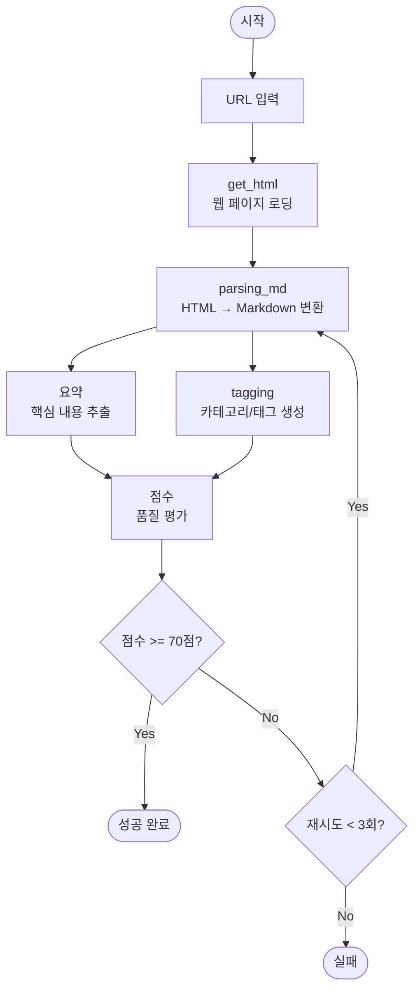

# AI Agent 워크플로우

## Mermaid 다이어그램

```mermaid
flowchart TD
      START([시작]) --> URL[URL 입력]
      URL --> HTML[get_html<br/>웹 페이지 로딩]
      HTML --> PARSE[parsing_md<br/>HTML → Markdown 변환]

      PARSE --> SUMMARY[요약<br/>핵심 내용 추출]
      PARSE --> TAGGING[tagging<br/>카테고리/태그 생성]

      SUMMARY --> SCORE[점수<br/>품질 평가]
      TAGGING --> SCORE

      SCORE --> DECISION{점수 >= 70점?}
      DECISION -->|Yes| SUCCESS([성공 완료])
      DECISION -->|No| RETRY{재시도 < 3회?}

      RETRY -->|Yes| PARSE
      RETRY -->|No| FAIL([실패])

```
